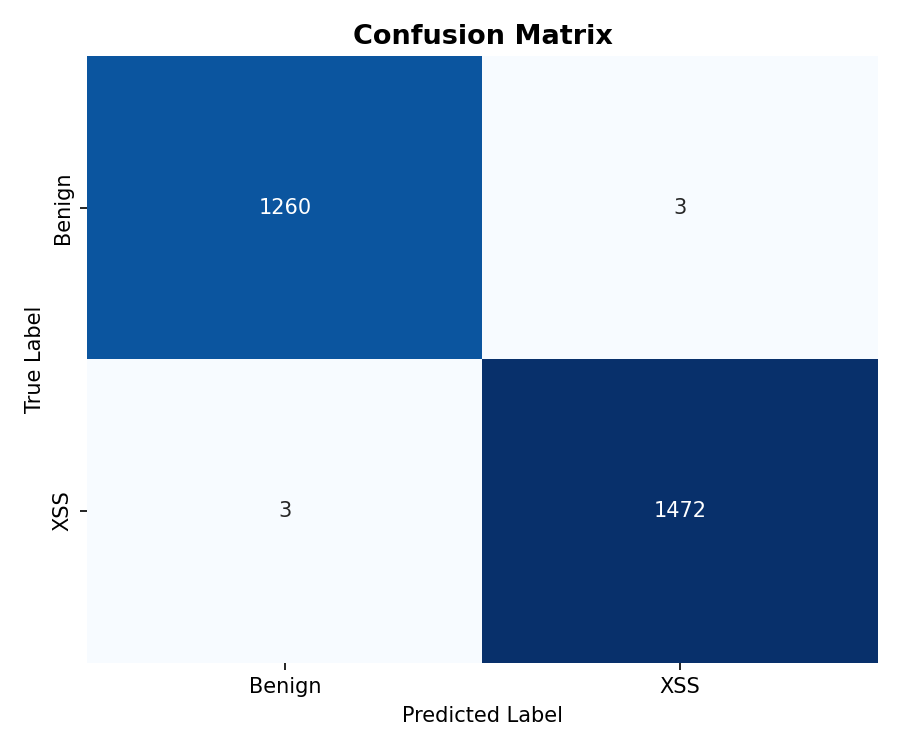
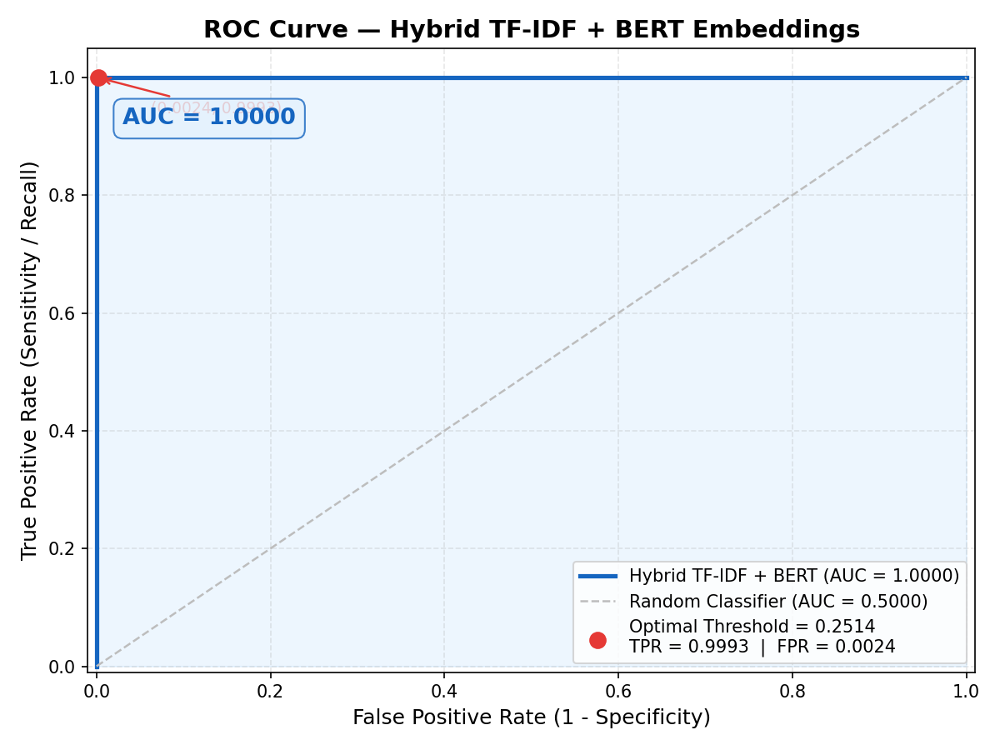
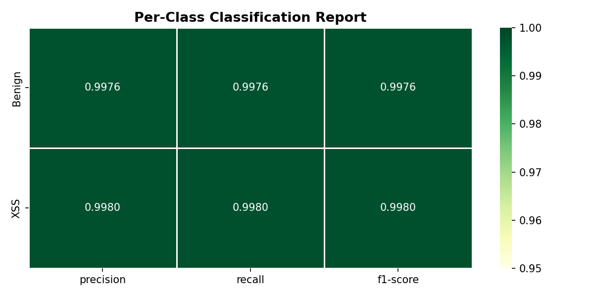
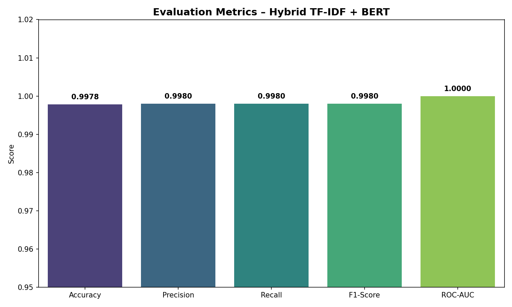
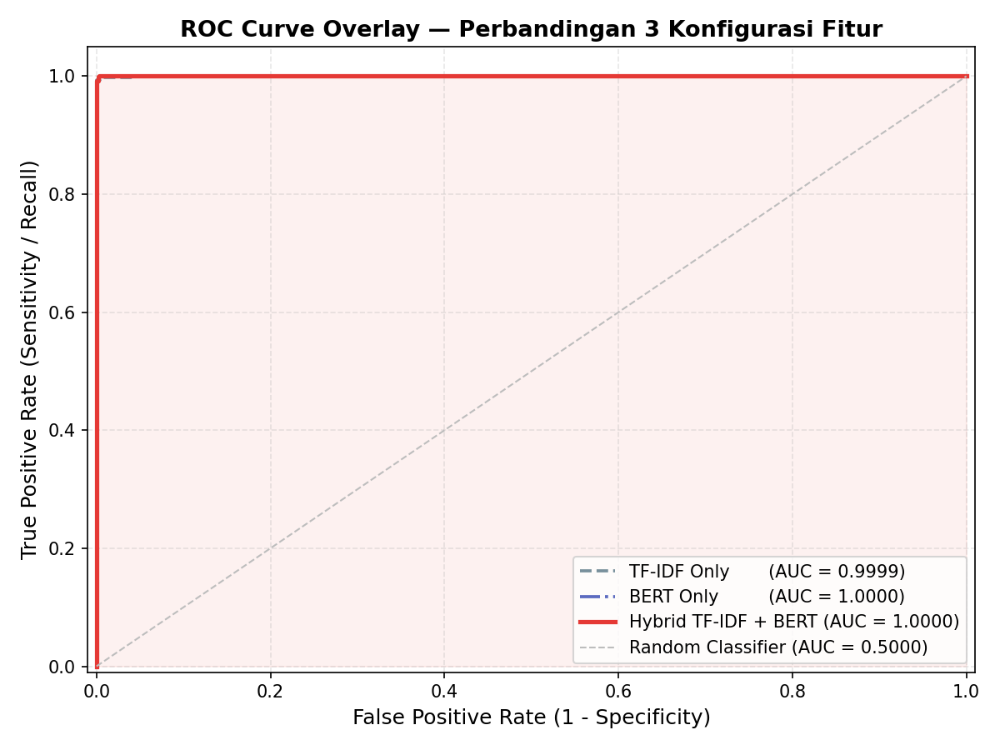
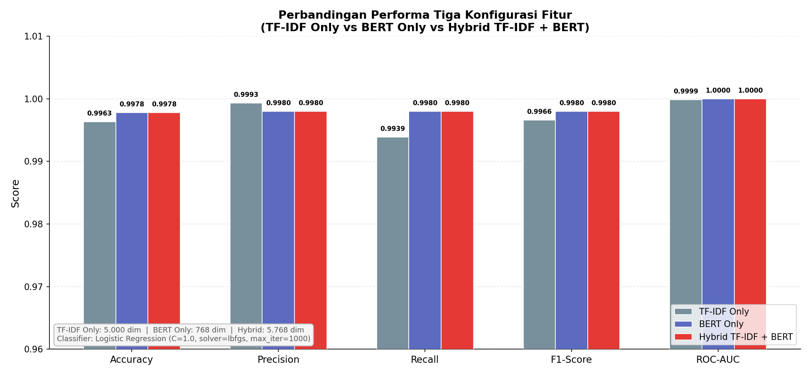
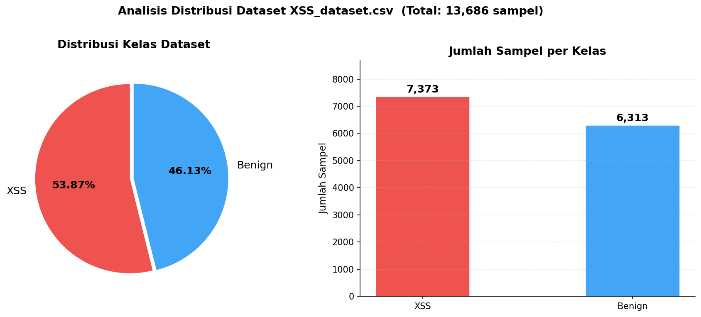

# XSS BERT Embeddings Detection (XSSentitel)

## 🚀 Overview
Project Skripsi: Deteksi serangan **Cross-Site Scripting (XSS)** menggunakan pendekatan Hybrid **TF-IDF** dan **BERT Embeddings**. Sistem ini menggunakan **FastAPI** untuk performa tinggi dan **BERT** untuk pemahaman konteks semantik.

## 🛠️ Features
- **FastAPI Backend**: Implementasi asinkronus yang cepat dan optimal.
- **Hybrid Architecture**: Logistic Regression + TF-IDF + BERT CLS token embeddings.
- **BERT Caching**: Optimasi latensi dengan caching embeddings.
- **Interactive UI**: Gradio demo untuk pengujian payload.

## ⚙️ Installation
1. Clone repository:
   ```bash
   git clone https://github.com/CtoXplt/XSSentitel.git
   cd XSSentitel
   ```
2. Install dependencies:
   ```bash
   pip install -r requirements.txt
   ```
3. Run FastAPI API:
   ```bash
   uvicorn api_fastapi:app --host 0.0.0.0 --port 5000
   ```
4. Run Gradio Demo:
   ```bash
   python app.py
   ```

## 📊 Model Evaluation
Bagian ini menunjukkan hasil analisis performa model Hybrid BERT + TF-IDF yang dikembangkan.

### 📈 Performance Visualizations
| Confusion Matrix | ROC Curve |
| :---: | :---: |
|  |  |

| Classification Report | Metrics Bar Chart |
| :---: | :---: |
|  |  |

### 🔍 Comparison & Distribution
| ROC Comparison | Configuration Comparison |
| :---: | :---: |
|  |  |

> **Note:** Dataset memiliki distribusi kelas yang seimbang seperti yang ditunjukkan pada plot distribusi kelas.
> 

## 📝 Dataset
Dataset yang digunakan berisi payload XSS dan benign string yang telah dipreproses.

## 🤝 Contributing
Project ini dikembangkan sebagai bagian dari tugas akhir (Skripsi). Kritik dan saran sangat diterima.

---
© 2026 XSSentinel Team
